# Network

The next largest attack surface is the network. Controlling network access
is fundamental to preventing the exfiltration of protected data.

Within the protected workloads running in AAW, all network activity
will be **deny-by-default**. Specific exemptions will be made
for accessing authorized storage environments and systems, with
each allowlisted service undergoing an assessment for its security
posture with regards to data exfiltration.

**Relation with Azure controls**: The AAW environment is relying
on defense-in-depth, so there are multiple levels of network
controls to restrict unauthorized network connectivity. Additionally,
the Azure controls cannot restrict access to specific services within
the cluster whereas the Kubernetes-level security controls can.

Finally, it is also important that all network activity be encrypted
using the Istio service mesh available in the Statistics Canada
Cloud Native Platform.

## Network policies

The primary mechanism for restricting network activity will be via Kubernetes
Network Policies. Network policies are implemented in the Azure Kubernetes
environment via the Linux iptables firewall on each node.

> **Recommendation NET-POL-01**: That traffic to and from Protected B
> workloads in the cluster be deny-by-default. Exceptions be made
> for operational needs only.

## In-transit encryption

Any service which is made available to Protected B workloads must be placed
on the Istio Service Mesh, which provides automatic TLS encryption for all
connectivity. Istio's TLS implementation is mutual TLS, therefore
both the client and the server verify each other's identity.

> **Recommendation NET-TR-01**: Istio be used for inter-service traffic
> of Protected B workloads, providing mutual TLS encryption.

> **Recommendation NET-TR-02**: A gatekeeper policy be implemented which
> prevents disabling the Istio sidecar on Protected B workloads.
>
> - Block the following annotations:
>   - `sidecar.istio.io/inject: 'false'`
>   - `traffic.sidecar.istio.io/excludeOutboundPorts`
>   - `traffic.sidecar.istio.io/excludeOutboundIPRanges`
>   - `traffic.sidecar.istio.io/excludeInboundPorts`
>   - `traffic.sidecar.istio.io/excludeInboundIPRanges`
> - Block containers from running as user `1337`, which
>   bypasses the Istio proxy

## External services

Protected B workloads should not connect directly to any external service.

> **Recommendation NET-ES-01**: Requests should be mediated
> through a service running in the AAW Kubernetes cluster, where possible.
> If not possible, then the service is to allow-listed on the firewall,
> since the firewall is deny-by-default. For protected workloads,
> these exceptions should be limited.

### Packages

Artifactory provides a package-proxy, which will provide the necessary
mediation between Protected B workloads and the remote repositories.
Artifactory is already utilized within the Statistics Canada main
cloud environment, so there is operational knowledge of the system.

Package sources should be limited due to the potential risk they can introduce.

> _NOTE_: This will require a paid Artifactory license.

Alternatively, installation of packages is not permitted. Only packages
available in the compiled Docker images would be made available in
the environment.

> **Recommendation NET-ES-02**: Packages be provided through an Artifactory
> instance running in the AAW environment.

> **Recommendation NET-ES-03**: X-Ray should be installed alongside Artifactory
> to provide for CVE scanning of packages being imported into the environment.

The use of Artifactory would also open up the possibility of user repositories
should this become a desired function of the Advanced Analytics Workspaces.

### Source code

Access to a source code system was identified during discussions
of the AAW environment.

A source code system available to both unclassified and Protected B
workloads introduces some complications from a security posture,
and in particular how to prevent data exfiltration from the environment.

Therefore, the recommendation for source code is a per namespace Gitea implementation.

> **Recommendation NET-ES-03**: For source code,
>
> 1. Continue to use external source code systems for unclassified workloads.
>    This is permitted via TBS policy:
>
>    > 6.1: Departments are to enable open access to the Internet for GC
>    > electronic networks and devices, including GC and external Web 2.0
>    > tools and services, to authorized individuals, as per Section 6.1.3
>    > of the Policy on Acceptable Network and Device Use (PANDU).
>    >
>    > — https://www.tbs-sct.gc.ca/pol/doc-eng.aspx?id=32588#cha5
>
>    In addition, a per-namespace Gitea implementation is proposed for both unclassified and protected-b work.
>    Most aspects of the architecture are shown in the diagram below.

```mermaid
flowchart TB;
  %% Global Label definitions
  pcont(aaw-kubeflow-profiles-controller)

  gitea_u_bob(Gitea)
  gitea_b_bob(Gitea)
  gitea_u_alice(Gitea)
  gitea_b_alice(Gitea)

  pg_b_bob[(Postgres DB\nbob)]
  pg_u_bob[(Postgres DB\nbob)]
  pg_b_alice[(Postgres DB\nalice)]
  pg_u_alice[(Postgres DB\nalice)]

  secret_b_bob["secret🔑"]
  secret_u_bob["secret🔑"]
  secret_b_alice["secret🔑"]
  secret_u_alice["secret🔑"]

  pinst_b(Azure Managed \nPostgres Instance\nProtected-b)
  pinst_u(Azure Managed \nPostgres Instance\nUnclassified)
  kf(Kubeflow)

  notebook_b_bob(notebook\nprot-b)
  notebook_u_bob(notebook\nunclassified)
  notebook_b_alice(notebook\nprot-b)
  notebook_u_alice(notebook\nunclassified)

  %% Links
  %% Links add hyperlinks to nodes
  click pcont "https://github.com/StatCan/aaw-kubeflow-profiles-controller"

  %% Main graph
  Terraform -- configures ----> pinst_b & pinst_u

  kf ----> notebook_b_bob & notebook_u_bob & notebook_b_alice & notebook_u_alice

  %% Sub-graphs

  subgraph Protected-b
    subgraph azure_b[azure]
      pinst_b -- creates --> pg_b_bob & pg_b_alice
      azureFW_b("Azure Firewall 🛡️
            allow protected-b
            nodepool connections
            to protected-b
            Postgres DB's")
    end
    subgraph b_bob[bob]
      gitea_b_bob --> secret_b_bob -- "connects🛡️" --> pg_b_bob
      notebook_b_bob -- connects --> gitea_b_bob
    end
    subgraph b_alice[alice]
      gitea_b_alice --> secret_b_alice -- "connects🛡️" --> pg_b_alice
      notebook_b_alice -- connects --> gitea_b_alice
    end
  end

  subgraph Unclassified
    subgraph azure_u[azure]
      pinst_u -- creates --> pg_u_bob & pg_u_alice
      azureFW_u("Azure Firewall 🛡️
            allow unclassified
            nodepool connections
            to unclassified
            Postgres DB's")
    end
    subgraph bob
      gitea_u_bob --> secret_u_bob -- "connects🛡️" --> pg_u_bob
      notebook_u_bob -- connects --> gitea_u_bob
    end
    subgraph u_alice[alice]
      gitea_u_alice --> secret_u_alice -- "connects🛡️" --> pg_u_alice
      notebook_u_alice -- connects --> gitea_u_alice
    end
  end

  subgraph daaas-system
    pcont -- creates --> secret_b_bob & secret_u_bob & secret_b_alice & secret_u_alice
    pcont -- connects -------> pinst_b & pinst_u
  end


  %% Styling
    %% colors
    classDef green fill:#229954
    classDef grey fill:#7B7D7D;
    classDef azureBlue fill:#5499C7;
    classDef giteaGreen fill:#266112;
    classDef kubeflowBlue fill:#2e4eb0;
    classDef terraformRed fill:#d44444;

    %% mappings to variables
    class Protected-b green
    class Unclassified grey

    class pg_b_bob azureBlue
    class pg_u_bob azureBlue
    class pg_b_alice azureBlue
    class pg_u_alice azureBlue
    class azure_FW azureFW

    class pinst_b azureBlue
    class pinst_u azureBlue

    class gitea_b_bob giteaGreen
    class gitea_u_bob giteaGreen
    class gitea_b_alice giteaGreen
    class gitea_u_alice giteaGreen

    class kf kubeflowBlue
    class notebook_b_bob kubeflowBlue
    class notebook_u_bob kubeflowBlue
    class notebook_b_alice kubeflowBlue
    class notebook_u_alice kubeflowBlue
    class Terraform terraformRed

    %% Lines
    linkStyle 0 stroke-width:1px,fill:none,stroke:red;
    linkStyle 1 stroke-width:1px,fill:none,stroke:red;

    linkStyle 2 stroke-width:1px,fill:none,stroke:blue;
    linkStyle 3 stroke-width:1px,fill:none,stroke:blue;
    linkStyle 4 stroke-width:1px,fill:none,stroke:blue;
    linkStyle 5 stroke-width:1px,fill:none,stroke:blue;
    linkStyle 10 stroke-width:1px,fill:none,stroke:blue;
    linkStyle 13 stroke-width:1px,fill:none,stroke:blue;
    linkStyle 18 stroke-width:1px,fill:none,stroke:blue;
    linkStyle 21 stroke-width:1px,fill:none,stroke:blue;

    linkStyle 8 stroke-width:1px,fill:none,stroke:green;
    linkStyle 11 stroke-width:1px,fill:none,stroke:green;
    linkStyle 16 stroke-width:1px,fill:none,stroke:green;
    linkStyle 19 stroke-width:1px,fill:none,stroke:green;
    linkStyle 9 stroke-width:1px,fill:none,stroke:green;
    linkStyle 12 stroke-width:1px,fill:none,stroke:green;
    linkStyle 17 stroke-width:1px,fill:none,stroke:green;
    linkStyle 20 stroke-width:1px,fill:none,stroke:green;

```

> Notable aspects of the design:
>
> - Each namespace in both unclassified and protected-b workloads will contain:
>   - A Postgres database. Note: There are two Azure managed Postgres instances,
>     a Protected-b instance, and an unclassified instance. A Postgres database will
>     be provisioned for each namespace in each instance.
> - A profile controller will to added to the
>   [aaw-kubeflow-profile-controllers](https://github.com/StatCan/aaw-kubeflow-profiles-controller)
>   repository:
>   - The controller will be responsible for creating a Postgres database and Gitea
>     instance for each Kubeflow profile
>   - The controller will also be responsible for the creation and management of
>     Kubernetes secrets that Gitea will use to connect to Postgres
> - The Azure firewall will be configured to allow:
>   - unclassified nodepool to connect to unclassified Postgres databases.
>   - protected-b nodepool to connect to protected-b Postgres databases.
